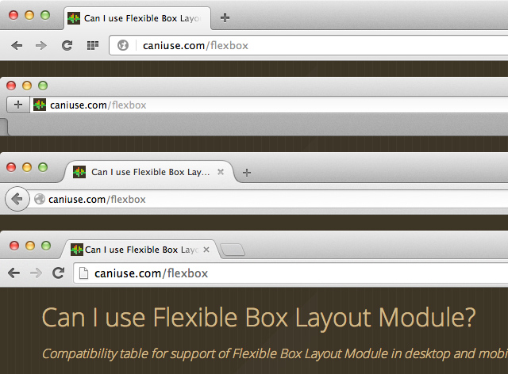
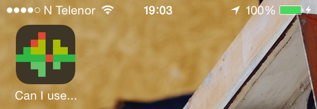

# Icon for “Can I use…”

Proposed icon for [Can I use…](http://caniuse.com).

  

That’s how it look in desktop browsers with `favicon.ico`

Saved as shortcut icon on iOS with with `apple-touch-icon.png`

